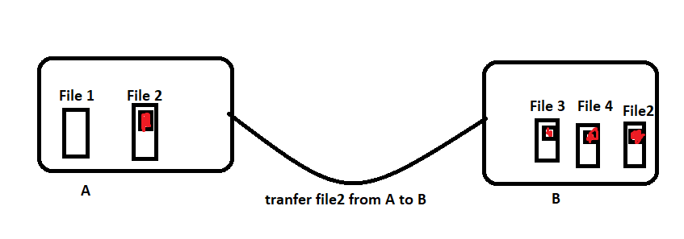
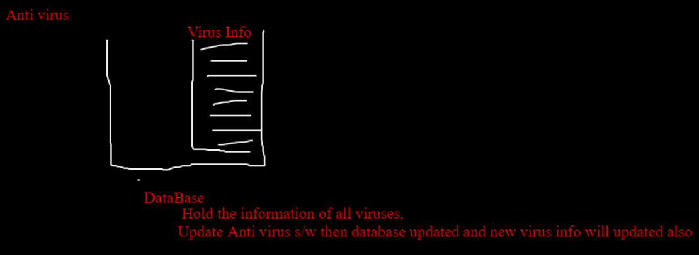

# **Computer Virus**

- Virus is also a **software** i.e. a piece of code which has ***ability to self Replicated*** 

- It can produce or spread from one file to another file.

## **Recognize whether our system is infected with Virus or not**

* Abnormal Performanance

* Response Time

* Pop Up

* Malicious or Unwanted Links

* Drivers not working

* Hard Disk Failed

* Unable to boot OS

## **Impact of Virus on our system**

* **Data Loss**

* **Programs Corrupted**

* **Files Corrupted**

* **Loose the control**

* **Login failed or password not working**

## **Types Of viruses**

*  **1. Resident Virus**

   * Virus places inside OS files

   * Os files or os program will be infected

* **2. File Infected Virus**

   * **.com** files or **.exe** files is effected

* **3. Macro Virus**

   * **.doc**, **.xls** effecting the documents

* **4. Boot Sector Virus**

   * The virus will be on Memory

   * Corrupt the OS

   * Hard Disks or External Drives

* **5. Web Scripting Virus**

   * Overwrite the code

   * Create a link which will download malicious software and from these software our file will infected.
   
* **6. Multi Partile Virus**

   * It will be available or infected  multiple parts either os or files.

* **7. Web Browser Hijacker**

   * It will automatically redirect to the malicious websites

   * Without any Human Interference redirect to malicious websites

   * Ex - Suddenly Default Home page will be change

> ***In All these cases Virus will be self replicated, that means it will directly create the same piece of code from one file to another file.*** 

## **Protection from Viruses**

* **Use Anti-Virus Program or Software and Keep updating**

   * Anti-virus will have one database which store all the details information of all virus in the database.

   * If you scan the computer It will check all these virus information.

   * If any one virus information is found.Anti-virus gives you warning with pop ups.
   

* **Before Clicking on any link, Check whether it's valid or not?**

* **Before download any file, Scan those files**

* **Block Pop ups on your browsers.**

